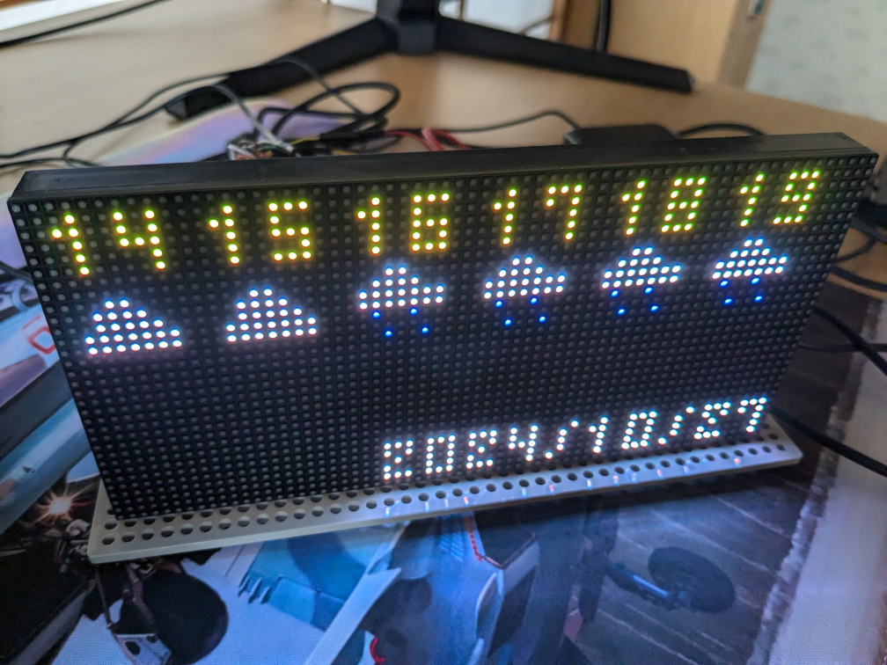
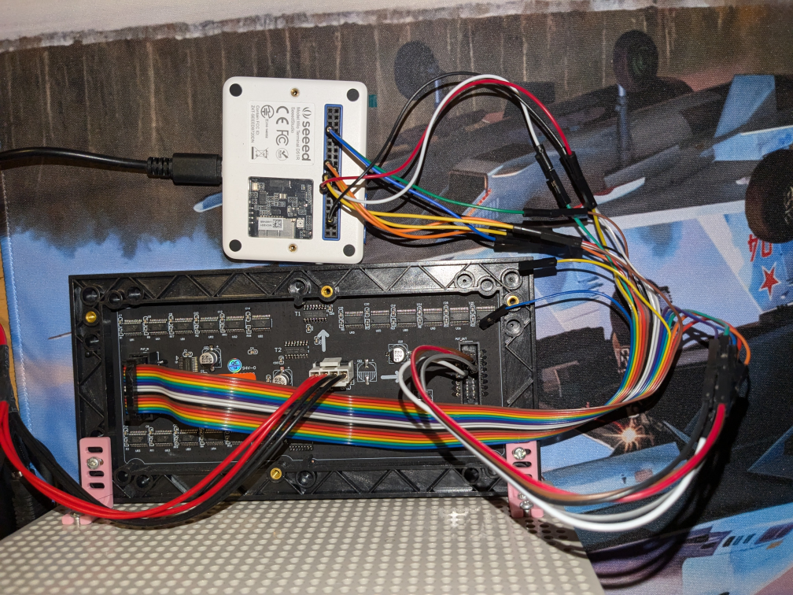

# Environment
* Hardware
  * LED matrix
    * RGB Full-Color LED Matrix Panel, 3mm Pitch, 64×32 Pixels (Waveshare)
      * https://www.switch-science.com/products/7553
      * https://www.waveshare.com/rgb-matrix-p3-64x32.htm
  * Controller
    * Wioterminal
      * https://www.switch-science.com/products/6360
      * https://www.seeedstudio.com/Wio-Terminal-p-4509.html
  * Others
    * Cable
      * https://www.amazon.co.jp/dp/B07JNHMK9Q
    * mobile battery
      * Anything that can supply 5V / 2.5A
    * jumper wires
      * Anything
* Software
  * OS
    * windows11
  * TinyGo
    * tinygo version 0.33.0 windows/amd64 (using go version go1.22.6 and LLVM version 18.1.2)

# Pin connection
* Pin definition
  * LED matrix
    * https://www.waveshare.com/wiki/RGB-Matrix-P3-64x32#Header_Definition
  * Wioterminal
    * https://www.seeedstudio.com/Wio-Terminal-p-4509.html
      * Pinout Diagram
* Pin connection

LED matrix Data output|to
---|---
R1 | Wioterminal:SPI_MOSI
G1 | LED matrix Data output:R2
B1 | LED matrix Data output:G1
GND | Wioterminal:GND
R2 | LED matrix Data output:R1
G2 | LED matrix Data output:R2
B2 | LED matrix Data output:R2
E | None
A | Wioterminal:D3
B | Wioterminal:D4
C | Wioterminal:D5
D | Wioterminal:D6
CLK | Wioterminal:SPI_SCLK
LAT/STB | Wioterminal:D1
OE | Wioterminal:D2
GND | None

  * supplement : QI 16pin cable
    * The top brown cable is R1, the second is G1, and the next is B1...

# Pictures
* LED matrix
  * 
* Pin connection
  * 
* QI 16pin cable
  * 

# Memo
source code citation [tinygo.org/x/drivers/hub75 (rev.1bf1a11067968352afa5d7a489a13561effb2146)](https://github.com/tinygo-org/drivers/tree/1bf1a11067968352afa5d7a489a13561effb2146/hub75)
