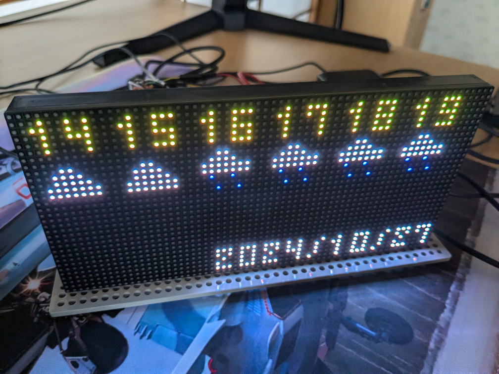

# Environment
* Hardware
  * LED matrix
    * RGB Full-Color LED Matrix Panel, 3mm Pitch, 64×32 Pixels (Waveshare)
      * https://www.waveshare.com/rgb-matrix-p3-64x32.htm
  * Controller
    * Wioterminal
      * https://jp.seeedstudio.com/Wio-Terminal-p-4509.html
  * Others
    * Cable
      * https://www.amazon.co.jp/dp/B07JNHMK9Q
    * mobile battery
      * Anything that can supply 5V / 2.5A
    * jumper wires
      * Anything
* Software
  * OS
    * windows11
  * TinyGo
    * tinygo version 0.33.0 windows/amd64 (using go version go1.22.6 and LLVM version 18.1.2)

# Picture

# Memo
source code citation [tinygo.org/x/drivers/hub75 (rev.1bf1a11067968352afa5d7a489a13561effb2146)](https://github.com/tinygo-org/drivers/tree/1bf1a11067968352afa5d7a489a13561effb2146/hub75)
